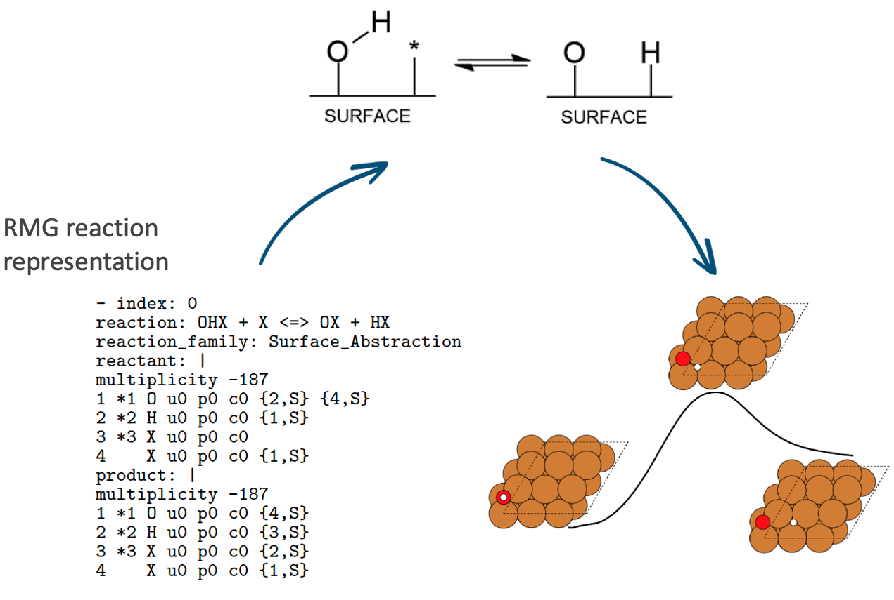

.. role:: raw-html-m2r(raw)
   :format: html

Pynta
=====

``pynta`` is an automated workflow code to enable the calculation of thermochemistry
and rate coefficients for reactions involving metallic surfaces.

The ``pynta`` code is designed to automatically characterize chemical reactions
relevant to heterogeneous catalysis. In particular, it spawns and processes a
large number of ab initio quantum chemistry calculations to study gas-phase
reactions on crystal facets. It is designed to run both on local clusters and
on petascale and upcoming exascale machines.

Pynta generates initial guesses for all gas phase species and adsorbates on the surface accounting
for the symmetry of the surface. These guesses are then optimized and frequencies are calculated for
the unique resulting geometries. Based on the provided reaction semi-atom mappings the
adsorbate are placed on the surface and perturbed in many unique ways to generate
transition state guesses, the best guesses are optimized and vibrational frequencies
and IRCs are generated for unique successfully optimized transition states. This
information can then be processed to generate thermochemistry and rate coefficients
for the adsorbates and reactions that can be used in microkinetic models.

Pynta is designed to work with the workflow code
`Fireworks <https://materialsproject.github.io/fireworks/>`_ , which provides users
with significant flexiblity in running Pynta.

Installation
============

Notes on Installation
^^^^^^^^^^^^^^^^^^^^^^^^^^^^^^^^^^^^^^^^^^^^^^^^^^^^^^^^^^^^^^^^^^^^^^^^

Pynta supports only Linux and MacOS installation and currently only
provides installation from source.

Install git
^^^^^^^^^^^^^^^^^^^^^^^^^^^^^^^^^^^^^^^^^^^^^^^^^^^^^^^^^^^^^^^^^^^^^^^^^^^^^^^^^^^^^^^^^^^^^^^^^^^^^^^^^^^^^^^^^^
If you do not already have `git` it needs to be installed. On linux install
with the appropriate package manager. On MacOS git should be installed through
XCode Commandline Tools. This can be done by simply running `git` if it is
not installed it will prompt you to install XCode Commandline Tools.

Install Anaconda
^^^^^^^^^^^^^^^^^^^^^^^^^^^^^^^^^^^^^^^^^^^^^^
Download the appropriate `Anaconda <https://www.anaconda.com/products/distribution#Downloads>`_
or `Miniconda <https://docs.conda.io/en/latest/miniconda.html>`_ . For the command line/bash installers find the downloaded
.sh file and run it with `bash` for example on linux this might look like:

.. code-block:: bash

  bash Anaconda3-2022.10-Linux-x86_64.sh

Make sure to tell the installer to append Anaconda/Miniconda to PATH when asked.

After installation you will need to exit and reopen your command line interface.
After doing so we (optionally) recommend that you install `mamba` to speed up a later part of the install:

.. code-block:: bash

  conda install mamba

Install the Pynta source code:
^^^^^^^^^^^^^^^^^^^^^^^^^^^^^^^^^^^^^^^^^^^^^^^^^^^^^^^^^^^^^^^^^^^^^^^^^^^^^^^^^^^^^^^^^^^^^^^^^^^^^^^^^^^^^^^^^^

.. code-block:: bash

   git clone git@github.com:zadorlab/pynta.git

Create a conda environment for Pynta
^^^^^^^^^^^^^^^^^^^^^^^^^^^^^^^^^^^^^^^^^^^^^^^^^^^^
Enter the Pynta source directory with:

.. code-block:: bash

   cd pynta

and then create the conda environment. If you have installed `mamba` run

.. code-block:: bash

   mamba env create -f environment.yml

else you can instead run the slower (but equally valid) commmand:

.. code-block:: bash

   conda env create -f environment.yml

Once this is done activate the generated environment with:

.. code-block:: bash

   conda activate pynta_env

Install MongoDB
^^^^^^^^^^^^^^^^^^^^^^^^^^^^^^^^^^^^^^^^^^^^^^^^^^^^^^^^^^^^^^^^^^^^^^^^^^^^^^^^^^^^^^^^^^^^^^^^^^^^^^^^^^^^^^^^^^^^^
The code for fireworks itself is installed within the created pynta_env, however Fireworks requires a MongoDB instance
to manage workflows. There are many different ways to configure this and the best way depends heavily on where and how you are
running Pynta. The community edition of MongoDB can be installed on a server or local computer you own, directions are available
`here <https://www.mongodb.com/docs/manual/administration/install-community/>`_ . Additionally a MongoDB can be setup with a
cloud provider. MongoDB provides a free option for their `MongoDB Atlas <https://www.mongodb.com/atlas/database>`_ that should
be sufficient for typical use of Fireworks.

Setup Fireworks
^^^^^^^^^^^^^^^^^^^^^^^^^^^^^^^^^^^^^^^^^^^^^^^^^^^^^^^^^^^^^^^^^^^^^^^^^^^^^^^^^^^^^^^^^^^^^^^^^^^^^^^^^^^^^^^^^^^^^^
Once the MongoDB is setup we can properly configure Fireworks. There are four configuration files that need written for
Fireworks: my_launchpad.yaml,my_fworker.yaml, my_qadapter.yaml and FW_config.yaml. The first, my_launchpad.yaml needs
setup for your particular MongoDB, an example is provided in the last section of this `page <https://materialsproject.github.io/fireworks/installation.html>`_ of the
fireworks documentation. The second, my_fworker.yaml can typically just be:

.. code-block:: yaml

  name: my first fireworker
  category: ''
  query: '{}'

The third my_qadapter.yaml is not necessary if you don't intend to have Fireworks submit jobs through a queue. A description of
how this operates within Fireworks is available in their documentation `here <https://materialsproject.github.io/fireworks/queue_tutorial.html>`_ . Examples of my_qadapter.yaml are
available `here <https://github.com/materialsproject/fireworks/tree/main/fw_tutorials/queue>`_ . Lastly the FW_config.yaml file should be
configured according to directions in the Fireworks documentation `here <https://materialsproject.github.io/fireworks/config_tutorial.html>`_ .
After configuring fireworks you should be able (after activating the pynta_env) run:

.. code-block:: bash

   lpad get_wflows

Fireworks has a lot of handy features that enable you to track workflow progress and statistics in their gui and commands that enable you to manually launch and pause components of the workflow. Their documentation is available `here <https://materialsproject.github.io/fireworks/index.html>`_ .

Testing Pynta
^^^^^^^^^^^^^^^^^^^^^^^^^^^^^^^^^^^^^^^^^^^^^^^^^^^^^^^^^^^^^^^^^^^^^^^^^^^^^^^^^^^^^^^^^^^^^^^^^^^^^^^^^^^^^^^^^^^^^^^^^^^^^^^^^^^^^^^^^^^^^^^^^^^^^^^^^^^^^^^^^^^^^^^^^^^^^^^^^^^^^^^^^^^^^^^^^^^^^^^^^^^^^^^^^^^^
Pynta has a set of unit and functional tests that can be run to ensure Pynta is properly installed
and executes properly. In the Pynta directory all tests can be run with

.. code-block:: bash

   make test-all

only unittests can be run with

.. code-block:: bash

   make test-unitests

and only functional tests can be run with

.. code-block:: bash

   make test-functional

Warning one of the functional tests runs a small, but structurally complete Pynta workflow. Depending on the speed
of the computer this can take a half hour to several hours to run.

Running Pynta
=============
In order to run Pynta we first need to describe the reactions we want Pynta to calculate. We do
this within a reactions.yaml file. This file describes the reactants, products and the atom
mapping between them in the RMG adjacency list `format <https://reactionmechanismgenerator.github.io/RMG-Py/reference/molecule/adjlist.html>`_ .
All atoms that are part of bonds that break and form in the reaction need to be labeled (with the same label) in both reactants and products.
The validity of adjacency lists can be checked using RMG's tool `here <https://rmg.mit.edu/molecule_search>`_ .

Example ``reactions.yaml`` file
^^^^^^^^^^^^^^^^^^^^^^^^^^^^^^^^^^

.. code-block:: yaml

  - index: 0
    reactant: 'multiplicity 1

      1 *3 O u0 p2 c0 {2,S} {5,S}

      2 *2 C u0 p0 c0 {1,S} {3,S} {4,S} {7,S}

      3    H u0 p0 c0 {2,S}

      4    H u0 p0 c0 {2,S}

      5 *4 H u0 p0 c0 {1,S}

      6 *1 X u0 p0 c0

      7 *5 X u0 p0 c0 {2,S}

      '
    product: 'multiplicity 1

      1 *3 O u0 p2 c0 {2,S} {6,S}

      2 *2 C u0 p0 c0 {1,S} {3,S} {4,S} {5,S}

      3    H u0 p0 c0 {2,S}

      4    H u0 p0 c0 {2,S}

      5 *4 H u0 p0 c0 {2,S}

      6 *1 X u0 p0 c0 {1,S}

      7 *5 X u0 p0 c0

      '
    reaction: OC[Pt] <=> CO[Pt]
    reaction_family: Surface_Migration
    - index: 1
      reactant: 'multiplicity 1

        1 *3 X u0 p0 c0 {2,D}

        2 *1 O u0 p2 c0 {1,D}

        3 *2 H u0 p0 c0 {4,S}

        4 *4 X u0 p0 c0 {3,S}

        '
      product: 'multiplicity 1

        1 *3 X u0 p0 c0 {2,S}

        2 *1 O u0 p2 c0 {1,S} {3,S}

        3 *2 H u0 p0 c0 {2,S}

        4 *4 X u0 p0 c0

        '
      reaction: '[Pt] + O[Pt] <=> O=[Pt] + [H][Pt]'
      reaction_family: Surface_Dissociation

Calling Pynta
^^^^^^^^^^^^^^^^^^^^^^^^^^^^^^
An example python script for calling Pynta is available below.

.. code-block:: python
  from pynta.main import Pynta

  pyn = Pynta(path,rxns_file,surface_type,metal,label,launchpad_path=None,fworker_path=None,
        vacuum=8.0,repeats=[(1,1,1),(3,3,4)],slab_path=None,software="Espresso",socket=False,queue=False,njobs_queue=0,a=None,
        software_kwargs={'kpts': (3, 3, 1), 'tprnfor': True, 'occupations': 'smearing',
                            'smearing':  'marzari-vanderbilt',
                            'degauss': 0.01, 'ecutwfc': 40, 'nosym': True,
                            'conv_thr': 1e-6, 'mixing_mode': 'local-TF',
                            "pseudopotentials": {"Cu": 'Cu.pbe-spn-kjpaw_psl.1.0.0.UPF',"H": 'H.pbe-kjpaw_psl.1.0.0.UPF',"O": 'O.pbe-n-kjpaw_psl.1.0.0.UPF',"C": 'C.pbe-n-kjpaw_psl.1.0.0.UPF',"N": 'N.pbe-n-kjpaw_psl.1.0.0.UPF',
                            }, },
        software_kwargs_gas=None,
        TS_opt_software_kwargs=None,
        lattice_opt_software_kwargs={'kpts': (25,25,25), 'ecutwfc': 70, 'degauss':0.02, 'mixing_mode': 'plain'},
        reset_launchpad=False,queue_adapter_path=None,num_jobs=25,
        Eharmtol=3.0,Eharmfiltertol=30.0,Ntsmin=5,frozen_layers=2)

  pyn.execute(generate_initial_ad_guesses=True,calculate_adsorbates=True,
                calculate_transition_states=True,launch=True)

The Pynta function has many parameters. It is best to divide them based on what they are associated with. First there are
the run parameters:

**path**: the directory in which Pynta will execute and save files

**rxns_file**: the location of the reactions.yaml file containing the reactions to calculate

Second there are the Fireworks parameters:

**launchpad_path**: the path to the my_launchpad.yaml file, by default it will use your default my_launchpad.yaml

**fworker_path**: the path to the my_fworker.yaml file, by default it will use your default my_fworker.yaml

**queue_adapter_path**: the path to the my_qadapter.yaml file, by default it will use your default my_qadapter.yaml

**reset_launchpad**: if true Pynta will reset the Fireworks launchpad during construction, this will delete any existing workflows on fireworks and is usually undesirable

**num_jobs**: the number of jobs for Pynta to launch if running on multiple nodes outside a queue

**queue**: if true will run Fireworks in queue mode using the file at queue_adapter_path

Third there are the slab specification parameters:

**metal**: the identity of the slab metal ex: Cu, Pt

**surface_type**: the facet ex: fcc111, bcc110

**vacuum**: the height of the vacuum in Angstroms above the slab in the cell

**repeats**: (x,y,z) where x,y,z are the number of atoms in the x,y and z directions in the slab

**a**: the lattice constant of the metal, if not specified and slab_path is not specified Pynta will calculate it

**slab_path**: path to the geometry of the slab, this will cause Pynta to skip slab generation, but must be consistent with metal, surface_type, vacuum and repeats

Fourth there are the ASE parameters that control the quantum chemistry calculation execution. All of these parameters need to be
specified in terms of what `ASE <https://wiki.fysik.dtu.dk/ase/>`_ expects.

**software**: this is the string corresponding to an ASE calculator object. Pynta will search ASE for a calculator with this name.

**software_kwargs**: this is the dictionary of keyword arguments passed to the ASE calculator object on construction. This particular dictionary is the default set of arguments.

**software_kwargs_gas**: this is a dictionary of keyword arguments that should be different from software_kwargs when running gas phase calculations

**TS_opt_software_kwargs**: this is a dictionary of keyword arguments that should be different from software_kwargs when running saddle point optimizations

**lattice_opt_software_kwargs**: this is a dictionary of keyword arguments that should be different from software_kwargs when optimizing the lattice constant

Lastly there are the Pynta energy filter criteria:

**Eharmtol**: a tolerance such that all TS/adsorbate guesses are always calculated if they have energies less than Emin * Eharmtol

**Eharmfiltertol**: a tolerance such that all TS/adsorbate guesses are never calculated if they have energies greater than Emin * Eharmfiltertol

**Ntsmin**: the minimum number of TS/adsorbate guesses. If the number of guesses with energies less than Emin * Eharmtol is less than Ntsmin Pynta will add the lowest energy guesses (that are less than Emin * Eharmfiltertol) until it has Ntsmin guesses.

**frozen_layers**: the number of layers (starting from the bottom of the slab) frozen during optimizations 

Pynta's execute function has a few important options:

**generate_initial_ad_guesses**: if False Pynta will not generate initial adsorbate guesses and assume they are already in the appropriate directories.

**calculate_adsorbates**: if False Pynta will not generate Fireworks jobs for calculating adsorbates and will assume the results are already in the appropriate directories.

**calculate_transition_states**: if False Pynta will not generate Fireworks jobs for finding and calculating transition states

**launch**: if True Pynta will attempt to launch the Fireworks workflow in infinite mode after it is constructed. If False the workflow is still generated and added to the launchpad, but it is left up to the user to handle launching through Fireworks commands.
